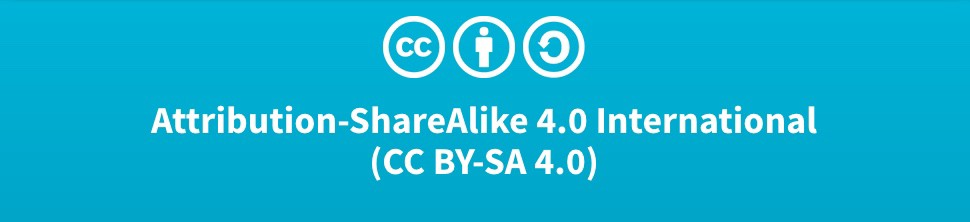

# Software and Data Technology - Weekly Update

## About

This repo is used as a centralized artifacts for [Wabi Teknologi](http://kamiwabi.id) program: **Software and Data Technology - Weekly Update**. It's a special program, consists of hands on workshop (around 2-3 hours) about current issues related to software and data technology. As its name implies, the update will be done every week. You are cordially invited to attend the workshop. See our [Instagram](https://www.instagram.com/kamiwabi/?hl=id) for more information.

## List

| No  | Date | Title | Presenter |
| ---:| ---- |-------| ------ |
| 1   | Feb 21, 2020 - 16:00 | [Native Cloud Application Development using Ballerina](week-0001/) | Dr. Bambang Purnomosidi D. P. |

## License

[CC-BY-SA 4.0 International](https://creativecommons.org/licenses/by-sa/4.0/deed.en)

