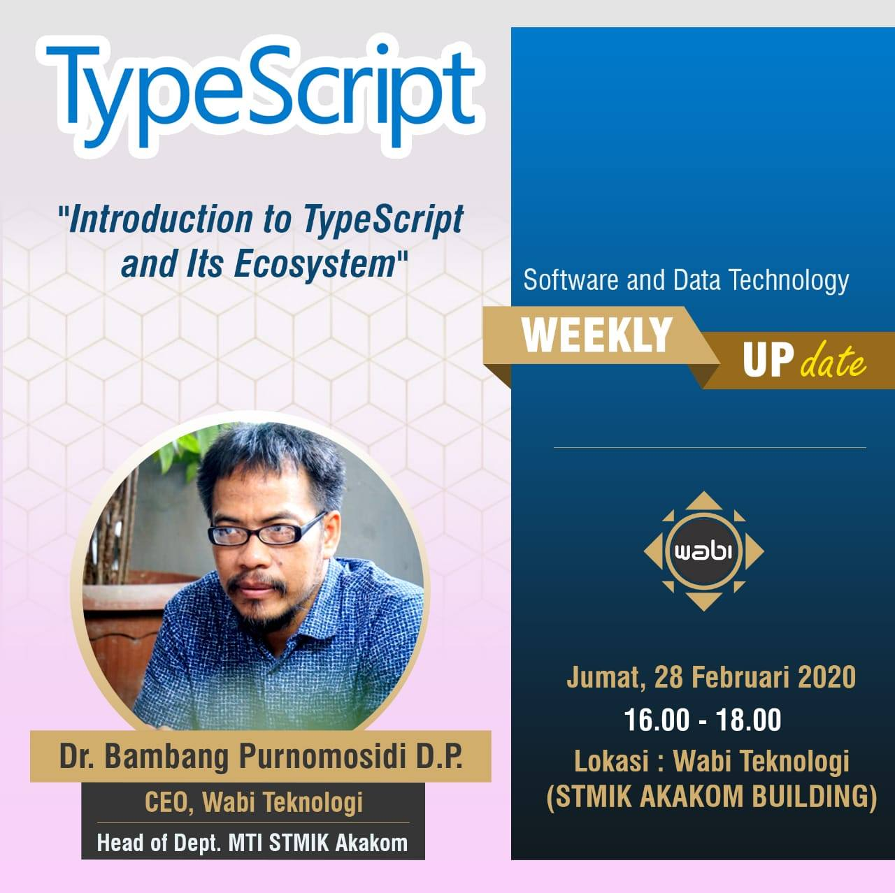

# Introduction to TypeScript and Its Ecosystem

[Back to list](https://github.com/kamiwabi/weekly-update)

## Software Needed

1.  [Node.js: LTS or Current](https://nodejs.org/en/).
2.  [TypeScript official compiler](https://www.typescriptlang.org/index.html#download-links).
3.  Latest [Deno](https://deno.land/) releases, available at [GitHub deno repo](https://github.com/denoland/deno/releases). 
4.  IDE: [Visual Studio Code](https://code.visualstudio.com/Download), default installation [already support TypeScript](https://code.visualstudio.com/docs/languages/typescript).
5.  [AssemblyScript](https://docs.assemblyscript.org/quick-start). You might go for global installation or local development.
6.  [NativeScript](https://docs.nativescript.org/start/quick-setup#quick-setup) for cross-platform native mobile app.
7.  [Angular](https://angular.io/guide/setup-local) for front-end.
8.  [Nest](https://docs.nestjs.com/first-steps) for back-end.
